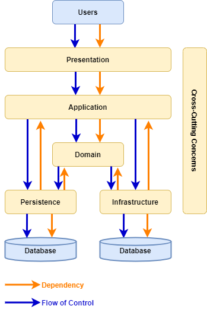
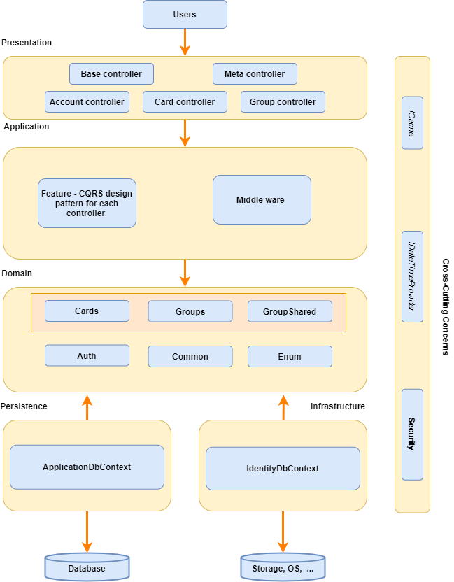
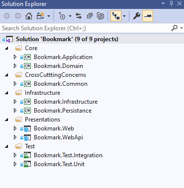

[](https://www.codacy.com?utm_source=github.com&amp;utm_medium=referral&amp;utm_content=es-hackathon/bookmark-dashboard-api&amp;utm_campaign=Badge_Grade)
[](https://github.com/es-hackathon/bookmark-dashboard-api/blob/develop/LICENSE)


# Bookmark Dashboard Web API

<br />
<p align="center">
  <a href="#">
    
  </a>

  <h3 align="center">Bookmark Dashboard Web API</h3>

  <p align="center">
    Web API solution template which is built on Clean Architecture using .Net Core for bookmark dashboard project!
    <br />
    <a href="https://github.com/es-hackathon/bookmark-dashboard-api"><strong>Explore the docs »</strong></a>
    <br />
    <br />
    <a href="https://github.com/es-hackathon/bookmark-dashboard-api">Download</a>
    ·
    <a href="https://github.com/es-hackathon/bookmark-dashboard-api/issues/new?assignees=&labels=&template=bug_report.md&title=">Report Bug</a>
    ·
    <a href="https://github.com/es-hackathon/bookmark-dashboard-api/issues/new?assignees=&labels=&template=feature_request.md&title=">Request Feature</a>
  </p>
</p>


<!-- TABLE OF CONTENTS -->
# Table of Contents

* [About the Project](#about-the-project)
* [Layer Dependencies](#Layer-Dependencies)
* [Layer examples](#Layer-examples)
* [Features available in this project](#Features-available-in-this-project)
* [Solution Structure](Solution-Structure)
* [How to Run](#How-to-Run)
* [Run or Debug the Solution](#Run-or-Debug-the-Solution)
* [Licence Used](#Licence-Used)


# About the Project

Web API solution template which is built on Clean Architecture using .Net Core for bookmark dashboard project!

# Layer Dependencies



[(open on draw.io)](./docs/layer-dependencies.drawio)

[reference code project](https://www.codeproject.com/Articles/5273373/Whiteapp-ASP-NET-Core-using-Onion-Architecture)

### Domain layer

Domain Layers (Core layer) is implemented in center and never depends on any other layer. Therefore, what we do is that we create interfaces to Persistence layer and these interfaces get implemented in the external layers. This is also known and DIP or Dependency Inversion Principle

### Persistence layer
 
In Persistence layer where we implement reposistory design pattern. In our project, we have implement Entityframework which already implements a repository design pattern. DbContext will be UoW (Unit of Work) and each DbSet is the repository. This interacts with our database using dataproviders

### Application layer 

Application layer where we can implement business logic. For OLAP/OLTP process, we can implement CQRS design pattern. In our project, we have implemented CQRS design pattern on top of Mediator design pattern via MediatR libraries

In case you want to implement email feature logic, we define an IMailService in the Service Layer.  Using DIP, it is easily possible to switch the implementations. This helps build scalable applications.

### Infrastructure Layer

In this layer, we add our third party libraries like JWT Tokens Authentication or Serilog for logging, etc.

### Cross cutting concern

In this layer, we add caching and other logic which will be common to all layer

### Presentation Layer

This can be WebApi or UI.
 
## Layer examples



[(open on draw.io)](./docs/layer-examples.drawio)

## Solution Structure




# How to Run
## Update Configuration

### Database 
  
- Update Connection Strings:

  | Project  | Configuration File | Configuration Key |
  | -------- | ------------------ | ----------------- |
  | Bookmark.WebApi | appsettings.json | ConnectionStrings:BookmarkConn <br> ConnectionStrings:IdentityConnection |
  | Bookmark.Web | appsettings.json | ConnectionStrings:BookmarkConn |

- Run Migration:
  + Option 1: Using dotnet cli:
    + Install **dotnet-ef** cli:
      ```
      dotnet tool install --global dotnet-ef --version="3.1"
      ```
    + Navigate to [Bookmark.WebApi](https://github.com/es-hackathon/bookmark-dashboard-api/tree/develop/src/Bookmark.WebApi/) and run these commands:
      ```
      dotnet ef migrations add Initial-commit-Application --context ApplicationDbContext -o Migrations/Application
      dotnet ef migrations add Identity-commit --context IdentityContext -o Migrations/Identity
      dotnet ef database update --context ApplicationDbContext 
      dotnet ef database update --context IdentityContext 
      ```
  + Option 2: Using Package Manager Console:
    + Set **Bookmark.WebApi** as StartUp Project
    + Open Package Manager Console, select **Bookmark.WebApi.Persistance** as Default Project
    + Run these commands:
      ```sh
      PM> add-migration Initial-commit-Application -Context ApplicationDbContext -o Migrations/Application
      
      PM> update-database -Context ApplicationDbContext 
      ```
    + Open Package Manager Console, select **Bookmark.WebApi.Infrastructure** as Default Project
    + Run these commands:
      ```sh
      PM> add-migration Identity-commit -Context IdentityContext -o Migrations/Identity
      PM> update-database -Context IdentityContext 
      ```


## Run or Debug the Solution
- Web MVC Home Page: https://localhost:44329/

- Navigate to Health Checks UI https://localhost:44329/healthchecks-ui#/healthchecks and make sure everything is green.


- Web API Page: https://localhost:44396/OpenAPI/index.html

  